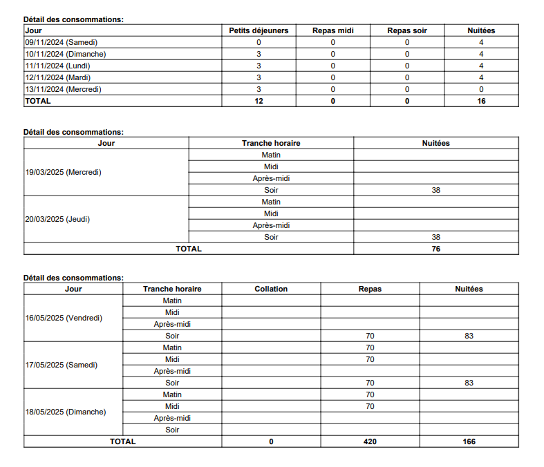

Les réservations sont modifiables (avec changement des dates et unités
locatives). Chaque modification engendre un nouveau contrat (qui, dans
le cas de modifications mineures, n'est pas nécessairement résigné).

Dans la liste des réservations le total de personnes associées à une
réservation est renseigné.

## Mode de présentation variable

1. Clients : demande de transparence (ventilation)
2. Clients : demande de présentation regroupée (pour les subsides)
3. Opérateurs : ne pas mettre le détail des packs pour éviter les
   demandes de modification (distinction devis et facture possible)

La piste retenue est de donner la possibilité de choisir le template à
utiliser pour les documents officiels (factures, contrats et devis) :

-   Simple (par défaut : facture opaque/minimaliste) : Seuls les groupes
    de services (séjours) sont visibles et présentent un seul montant.
-   Regroupé (à la demande) : Le détail des services est renseigné, mais
    les prix sont présentés au niveau des séjours / groupes de services.
-   Détaillé (à la demande) : Toutes les lignes de services sont
    renseignées avec le prix et la quantité pour chaque service (on ne
    transmet la facture détaillée que à la demande du client)

Pour la TVA, on fonctionne de la même manière :

-   Simple : opaque (par groupe), sans colonne TVA (sans ventilation
    TVA)
-   Détaillé : détaillé avec colonne TVA et ventilation TVA dans la
    somme.

## Verrouillage des contrats

Dans certains cas, les contrats peuvent avoir été négociés et qui ne
peuvent plus être modifiés.
Pour permettre ceci, les contrats peuvent être bloqués (verrouillés).
Lorsqu'un contrat est verrouillé, la réservation ne peut plus repasser
en Devis.

## Logique pour modification de réservation

-   Utilisation d'un champ 'is_locked' pour les contrats

-   Le blocage d'un contrat se fait par une action spécifique disponible
    au niveau du contrat

-   Lorsqu'il est bloqué, un contrat ne peut être débloqué que par les
    admins.

-   Dans la liste des contrats d'une réservation, un indicateur
    renseigne l'état de blocage des contrats

-   Lorsque son contrat (le plus récent) est bloqué, une réservation ne
    peut plus repasser en devis

Note : dans tous les cas, lorsqu'une réservation repasse en devis, tous
ses prix (hors prix manuels) sont recalculés sur base de la liste de
prix applicable aux dates de ses séjours.

## Récapitulatif des consommations

Pour la génération des documents du Devis, de l'Option ou du Contrat,
il sera possible d'afficher le tableau du Détail des consommations en
format simple ou détaillé. En option simple, une colonne sera dédiée aux
jours, aux repas (petits déjeuners, déjeuners, dîners) et au nombre de
nuitées.

En option détaillée, les informations seront réparties par jour, tranche
horaire, nombre de collations, nombre de repas et nombre de nuitées. Les
tranches horaires seront classées en groupes : matin, midi, après-midi
et soir.

Dans la classe "Types de réservation", un champ "Impression de
composition" est disponible, avec les options simple ou détaillée, qui
seront utilisées pour afficher les consommations dans la vue du Devis,
de l'Option et du Contrat.

## Pièces jointes

Des documents sont ajoutés aux emails envoyés pour les contrats des
réservations. (Les CGV sont des documents repris dans la catégorie
« conditions_generales ».)

Il y a également des entités "pièces jointes" qui permettent de faire
le lien entre les documents et les réservations, sur base de leur type
(attachment_type) : "tous", "écoles", "individuels", "groupes"
et du type de réservation (type_id) : "individuel TP", "Groupe TPG",
"Stage STA", "Séjour scolaire SEJ", ...
