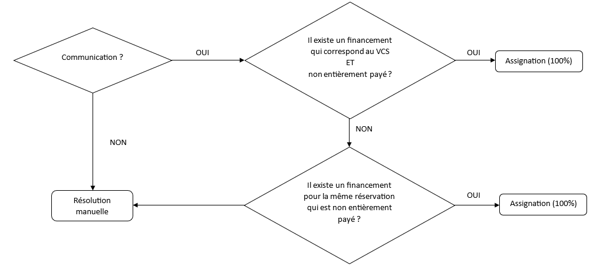

Pour réconcilier les sommes reçues avec les réservations, on utilise des
entités spécifiques appelées « financements » (Funding), qui indiquent
ce que les clients doivent payer. En d'autres termes, les réservations
définissent les montants attendus. Les financements permettent ainsi de
suivre les paiements, qu'ils soient effectués par virement bancaire ou
en caisse.

Les financements sont généralement générés automatiquement :

-   Lors de la confirmation de la réservation (en même temps que
    l'émission du contrat); selon le plan de financement sélectionné;

-   Lors de l'émission d'une facture (une facture ajoute un
    financement à la réservation à laquelle elle est rattachée ; à
    l'exception des factures avec un solde nul).

Par conséquent, pour pouvoir faire le paiement d'une réservation via la
caisse ou pour pouvoir réconcilier un virement bancaire lié à une
réservation, il faut que la réservation dispose au moins d'un
financement.

## Récapitulatif de la logique de fonctionnement des financements

-   Le montant dû d'un financement n'est jamais nul \[0 EUR\] (par
    contre la différence entre montant du et montant payé peut
    l'être) ;

-   Un financement est toujours lié à 0 ou 1 facture ET tous les
    financements d'une réservation clôturée sont liés à une facture ;

-   Une facture peut être rattachée à 0 ou plusieurs financements (une
    facture nulle \[solde de 0 EUR\] PEUT ne pas avoir de financement) ;

-   Un nouveau financement de facture est toujours initialement du même
    signe que sa facture (le signe peut différer ultérieurement en
    fonction des paiements assignés au financement) ;

-   Un financement de note de crédit est toujours négatif (montant à
    rembourser) ;

-   Lorsqu'un financement a été lié à une facture, il ne peut être
    supprimé que si la facture est annulée (et qu'aucun paiement n'est
    attaché au financement) ;

-   Un financement est rattaché à 0 ou plusieurs paiements (caisse,
    virement bancaire, ou paiement en ligne) ;

-   Toutes les factures peuvent être annulées via note de crédit (les
    notes de crédit ne peuvent pas être annulées)

## Récapitulatif des situations pour la gestion des paiements

1. Le client n'a pas payé les acomptes attendus

    -   Lors de l'émission de la facture de solde, les financements
        sont supprimés
    -   La facture de solde est émise pour un montant correspondant à
        celui de la réservation
    -   Un nouveau financement est créé avec le montant attendu
        (positif)

2. Le client a déjà payé des acomptes pour un total supérieur à ce
    montant

    -   La facture de solde émise est donc négative
    -   Un financement supplémentaire est créé, avec un montant négatif
        (à rembourser)

3. On se rend compte qu'on a oublié de facturer quelque chose et on
    ajoute des services ; le montant final est alors supérieur au
    montant déjà reçu

    -   Faire une note de crédit, qui est alors positive et repasser à
        l'état « terminée », ajouter les services manquants, et
        repasser à l'état « facturée »

    -   Lorsqu'on annule (via note de crédit) une facture, ses
        financements sont supprimés (sauf si \[partiellement\] payés)

    -   Un financement est créé qui correspond au montant de la note de
        crédit

    -   Lorsqu'on regénère une facture de solde, les financements non
        payés sont supprimés (y compris note de crédit)

    -   La facture est alors positive, et un nouveau financement est
        créé, correspondant au solde restant (montant dû - montants déjà
        payés)

4. Lors du paiement d'un financement, un client paie plus que le
    montant attendu.

    -   Le montant payé est découpé en deux paiements, associés au
        financement de solde

    -   Il faut créer un nouveau financement de remboursement (négatif)

    -   Le remboursement est fait par la comptabilité : après le
        versement, les CODA avec des lignes de remboursement sont alors
        assignées aux financements correspondants

## Situations spécifiques

Plusieurs manipulations sont réalisées automatiquement par Discope, lors
de certains événements :

### Confirmation de la réservation

C'est lors de la confirmation de la réservation que le contrat et le
plan de paiement sont générés.

Le plan de financement détermine les échéances des prépaiements et les
financements relatifs à créer.

Lors d'aller-retours entre l'état devis et confirmé, il est possible
que des financements aient été émis précédemment.

Si certains financements déjà créés ont été payés ou partiellement payés :

-   On les modifie pour que le montant attendu corresponde au montant
    payé

-   Les montants des nouveaux financements sont adaptés pour que le
    total corresponde au prix renseigné dans le contrat

### Émission de la facture de solde

Si on a demandé des acomptes, et qu'ils ont été partiellement payés,
lors de l'émission de la facture:

-   On les modifie pour que le montant attendu corresponde au montant
    payé

-   On les fait pointer vers la nouvelle facture

-   On ajoute une ligne en négatif sur la facture générée

### Réconciliation des extraits de banque

Les extraits sont réconciliés en créant des paiements qui sont rattachés
à des financements existants.

-   On peut mettre un montant reçu par versement sur un financement
    d'un montant attendu supérieur

-   Si on choisit un financement d'un montant inférieur, le montant de
    la réconciliation est automatiquement adapté à celui du financement,
    mais il est possible de "forcer" le montant de la réconciliation
    (et donc d'avoir, pour le financement ciblé, un montant reçu
    supérieur au montant attendu)

-   Il n'est jamais possible d'assigner un montant de réconciliation
    qui soit supérieur à celui du montant reçu (renseigné dans la ligne)

-   Lorsque le total des paiements assignés à un financement est
    supérieur ou égal à son montant attendu, le financement n'est plus
    proposé dans les listes de sélection pour la création de paiements
    (réconciliation CODA et paiement par caisse).

### Modification du plan de financement

Lorsque les services réservés d'une réservation sont modifiés (passant
de réservation à devis) ou lors de la confirmation de la réservation :

-   Tout financement impayé existant avant la confirmation est supprimé.

-   Les financements payés ou partiellement payés sont conservés.

Si un contrat est ajouté avec un plan de financement distinct, un
nouveau plan est établi en fonction du solde de la réservation, en
prenant en compte les financements conservés.

S'il n'y a qu'un seul financement, il est ajusté selon la différence
entre le prix total déduit des paiements déjà reçus.

Dans le cas où la somme totale des financements payés dépasse le montant
total de la réservation, aucun nouveau financement n'est créé.
